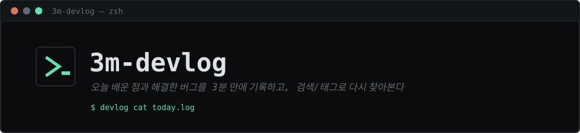
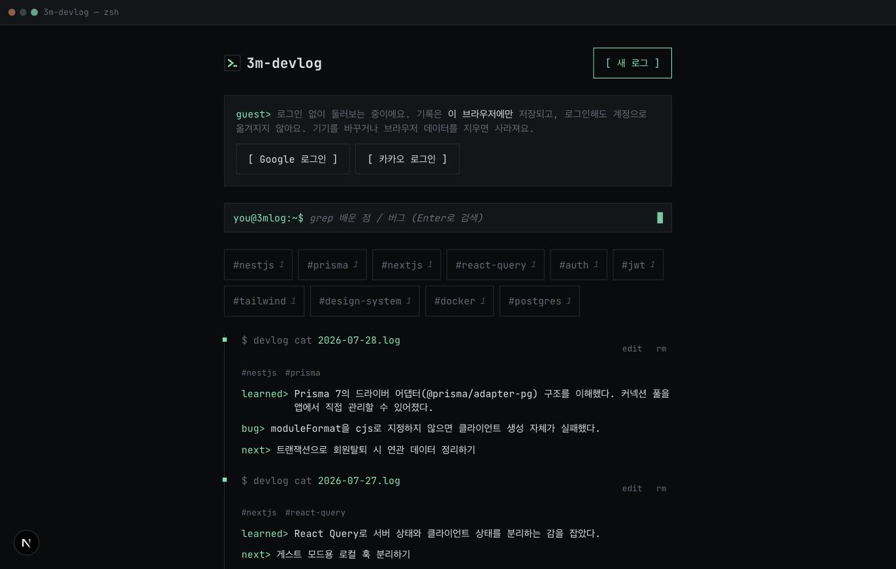
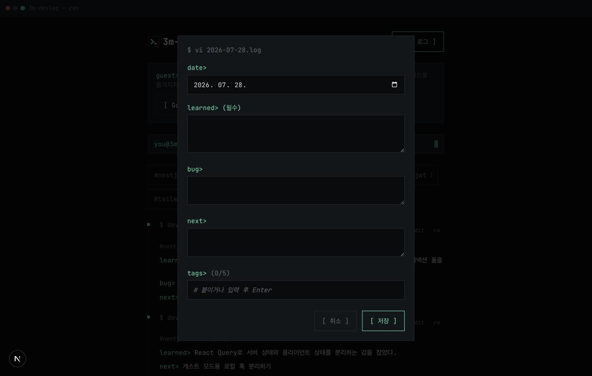
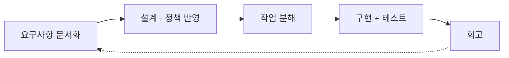
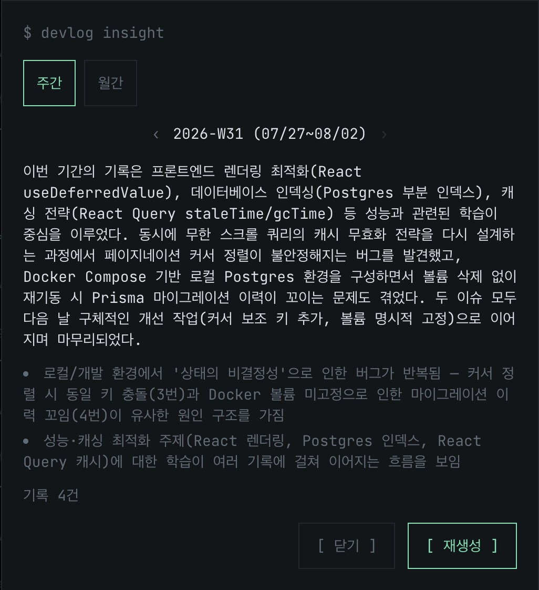

<div align="center">



[](https://nextjs.org/)
[](https://nestjs.com/)
[](https://www.typescriptlang.org/)
[](https://www.prisma.io/)
[](https://www.postgresql.org/)
[](https://tailwindcss.com/)

요구사항: [`requirements/2026-W30/3m-log 요구사항_20260723.md`](./requirements/2026-W30/3m-log%20요구사항_20260723.md) · 도메인 모델: [`docs/domain-model.md`](./docs/domain-model.md)

</div>

## 스크린샷

| 메인 화면 (게스트 모드) | 로그 작성 |
|---|---|
|  |  |

## Goal

이 프로젝트의 목적은 서비스 자체보다 AI와 함께 문제를 정의하고 개발하는 과정에 있습니다.

## AI Workflow

새 요구사항이 들어오면 아래 순서로 처리합니다.



### 1. 요구사항 문서화

요구사항은 한 번에 확정하지 않고 [`requirements/`](./requirements)에 버전별 문서로 남깁니다. 기존 문서를 베이스로 추가/변경되는 내용만 정리합니다.

### 2. 설계 영향 확인

구조(애그리거트, 컨텍스트 등)에 영향이 있으면 [`docs/domain-model.md`](./docs/domain-model.md)를 갱신합니다. 단순 정책 변경이면 건너뜁니다.

### 3. 정책 반영

비즈니스 규칙이 새로 생기거나 바뀌면 [`docs/policies.md`](./docs/policies.md)를 현재 상태로 갱신합니다. 변경 이력은 남기지 않습니다 — 요구사항 문서와 [`tasks/`](./tasks)가 그 역할을 합니다.

### 4. 작업 분해

[`tasks/`](./tasks) 안 ISO 주차별 파일로 요구사항별 체크리스트를 관리하며 진행 상황을 추적합니다 (자세한 폴더 구조는 [`tasks/README.md`](./tasks/README.md) 참고).

### 5. 구현

코드를 작성하고 테스트로 검증하며, 체크리스트 항목을 하나씩 완료 처리합니다.

### 6. 회고

세션마다 얻은 교훈을 [`CLAUDE.md`](./CLAUDE.md)에 남겨, 다음 세션에서 같은 실수를 반복하지 않게 합니다.

### 아키텍처 결정 기록

`domain-model.md`/`policies.md`는 "지금 무엇인가"만 담고 이력을 남기지 않습니다. 되돌리기 어렵고 나중에 재논쟁될 가능성이 높은 기술적 결정(라이브러리·아키텍처·인증 방식 선택 등)은 그 반대로 "왜 그렇게 결정했는가"를 [`docs/decisions.md`](./docs/decisions.md)에 append-only로 남깁니다. 모든 요구사항 처리마다 쓰는 게 아니라, 위 기준에 해당할 때만 선택적으로 추가합니다.

### AI에게 맡긴 것 vs 직접 판단한 것

우선순위나 정책 같은 결정은 직접 내리고, 익숙하지 않은 스택의 구현 디테일은 AI에게 맡깁니다.

## 특징

- 터미널 GUI 컨셉의 미니멀 다크 테마, 모바일 퍼스트
- 로그인 없이도 바로 써볼 수 있는 게스트 모드 (로컬 저장, 서버 전송 없음)

## 기능

- **기록**: 배운 점 / 트러블슈팅 / 내일 할 일 3가지 관점으로 정리, 과거 날짜 소급 작성(최대 1개월)
- **태그**: 로그당 최대 5개, 대소문자 무관 정규화, 사용 빈도순 노출
- **검색/필터**: 키워드 검색 + 태그 + 기간(7일/30일/전체) 조합 필터
- **연속 기록 배지**: 씨앗 → 새싹 → 화분 → 나무 단계로 꾸준함 시각화
- **인증**: 구글/카카오 소셜 로그인, 마이페이지에서 통계 확인·회원탈퇴

### AI 인사이트

주간/월간 단위로 활동을 요약하고 반복되는 패턴을 짚어주는 AI 회고 기능입니다. 기간당 결과는 최신 1건만 유지하며, 이미 생성된 결과가 있으면 재호출 없이 바로 보여줍니다.



## 기술 스택

| 영역 | 선택 |
|---|---|
| Frontend | Next.js 16 (App Router, Turbopack), TypeScript, Tailwind CSS v4, TanStack React Query |
| Backend | NestJS 11, TypeScript |
| DB / ORM | PostgreSQL 16, Prisma 7 (driver adapter: `@prisma/adapter-pg`) |
| 로컬 인프라 | Docker Compose (Postgres) |

## 폴더 구조

```
server/   # NestJS API 서버
view/     # Next.js 프론트엔드
```

로컬 실행, API 명세, 테스트, 아키텍처 노트는 각 서브 프로젝트 README 참고: [`server/README.md`](./server/README.md), [`view/README.md`](./view/README.md). 배포 관련 내용은 [`docs/deployment.md`](./docs/deployment.md) 참고.
