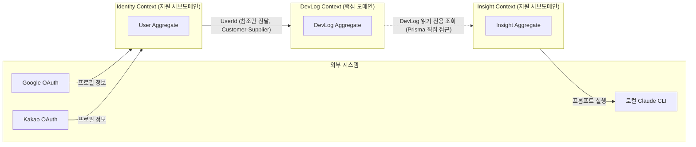
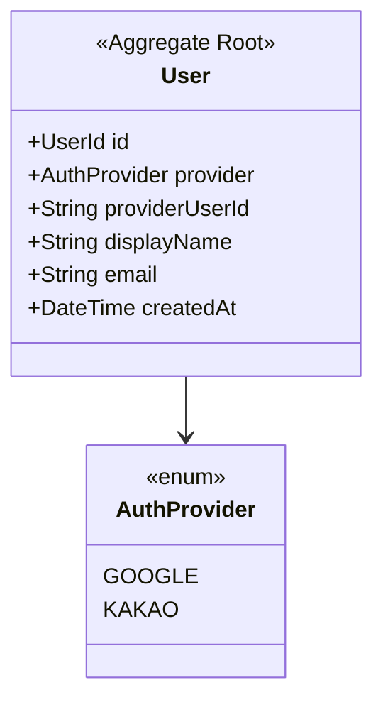
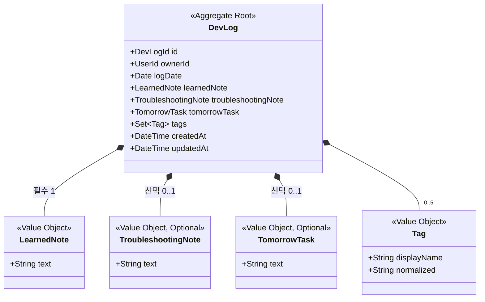
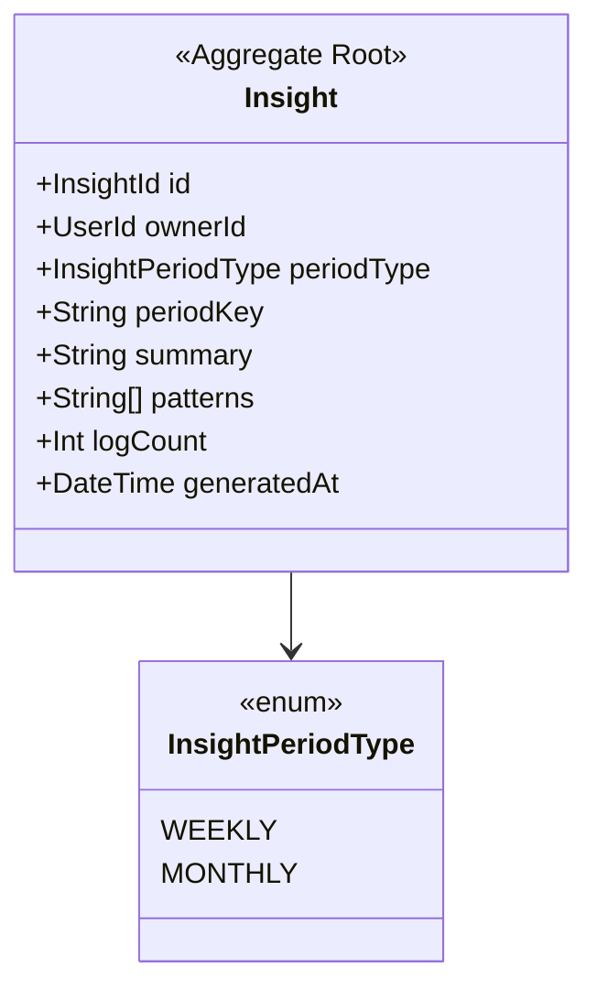
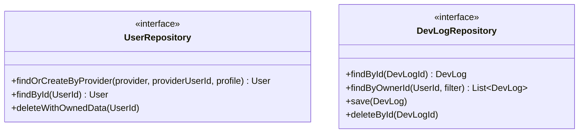

# 3m-log 도메인 모델 (DDD)

요구사항 문서(`requirements/2026-W30/3m-log 요구사항_20260723.md`) 기반의 전략적/전술적 설계 초안. 로직 구현 전, 애그리거트 경계와 컨텍스트 관계를 먼저 정리한다. 비즈니스 정책/규칙은 [docs/policies.md](./policies.md)에 별도로 정리한다.

## 1. 유비쿼터스 언어

| 용어 | 의미 |
|---|---|
| User | 소셜 로그인(구글/카카오)으로 식별되는 서비스 이용자 |
| DevLog | 하루 단위로 작성하는 개발 기록 (배운점 + 버그 + 내일 할 일 + 태그) |
| LearnedNote | 오늘 배운 점 (필수 입력) |
| TroubleshootingNote | 해결한 버그 / 시행착오 (선택 입력) |
| TomorrowTask | 내일 할 일 (선택 입력) |
| Tag | 로그 분류 키워드. 대소문자 무관하게 동일 태그로 취급 |
| Owner | DevLog를 작성한 User. 본인만 조회/수정/삭제 가능 |

## 2. 바운디드 컨텍스트

- **Identity Context**: OAuth 제공자(Google/Kakao)로부터 받은 프로필을 내부 `User`로 변환(ACL 역할). 핵심 도메인이 아니므로 최소 기능만 유지.
- **DevLog Context**: 실제 비즈니스 가치가 있는 핵심 도메인. `User` 전체가 아니라 `UserId`만 참조 — 두 컨텍스트를 강결합하지 않기 위함.
- **Insight Context**: 로그인 사용자의 DevLog를 기간(주간/월간)별로 모아 AI 회고 요약을 생성하는 지원 서브도메인(`src/insight/`). DevLog 애그리거트를 커맨드로 변경하지 않고 조회만 하며, `DevLogService`를 의존/임포트하지 않고 `InsightService`가 Prisma로 DevLog 테이블을 직접 조회한다 — 컨텍스트 간 코드 결합 없이 데이터베이스 레벨의 읽기 전용 참조만 존재. 실제 요약 생성은 `InsightGenerator` 포트 뒤에 숨겨진 로컬 Claude CLI 서브프로세스(`ClaudeCliInsightGenerator`)가 담당하며, 포트만 구현하면 추후 실제 API 키 기반 구현으로 교체 가능.
- 별도의 "Search Context"는 두지 않는다. 검색/인기태그는 DevLog 컬렉션에 대한 조회(Read Model) 관심사이지 독자적 애그리거트가 필요한 영역이 아님 (불필요한 컨텍스트 분리는 이 단계 규모에서 과설계).

## 3. 애그리거트 설계

### 3.1 User Aggregate (Identity Context)

- 불변식: `(provider, providerUserId)` 쌍은 유일 — 최초 로그인 시 JIT(Just-In-Time) 프로비저닝의 조회 키.
- User는 자기 완결적이며 DevLog를 직접 참조하지 않는다 (참조 방향은 DevLog → UserId 단방향).

### 3.2 DevLog Aggregate (DevLog Context) — 핵심 애그리거트

- **경계 안(애그리거트 내부에서 강제되는 불변식)**
  - `LearnedNote`는 공백일 수 없음 (필수 입력).
  - `Tags`는 `normalized`(소문자 trim) 기준 중복 없음 — `React`와 `react`는 저장 시점에 하나로 합쳐짐, `displayName`은 최초 입력값 유지.
  - `Tags`는 최대 5개까지 (2026-07-28-2 요구사항으로 확정).
  - `logDate`는 오늘부터 과거 최대 1개월 이내만 허용, 미래 날짜 불가 (2026-07-28-2 요구사항으로 확정).
  - 수정/삭제는 `ownerId == 요청자 UserId`인 경우에만 허용 (권한 검사는 애그리거트가 요청자 컨텍스트를 알고 커맨드를 거부하는 형태로 표현 — 상세는 애플리케이션 레이어에서 구체화).
- **Tag를 별도 애그리거트로 분리하지 않은 이유**: Tag 자체는 독립적 생명주기나 식별자가 필요 없음. "인기 태그"는 Tag의 상태가 아니라 DevLog 컬렉션에 대한 집계 쿼리 결과이므로, Tag를 애그리거트로 승격시키면 DevLog 저장 시마다 별도 트랜잭션/동시성 문제만 늘어남 (과설계 방지).

### 3.3 Insight Aggregate (Insight Context)

- 불변식: `(ownerId, periodType, periodKey)` 조합은 유일 — 같은 기간을 다시 생성 요청하면 upsert로 덮어쓰고, 기간당 최신 1건만 남는다(과거 이력은 보관하지 않음).
- `periodKey` 형식: 주간은 ISO 8601 주차(`"2026-W31"`), 월간은 캘린더월(`"2026-08"`). 오늘이 속한 기간보다 미래인 `periodKey`는 생성 요청 자체를 거부한다(애플리케이션 레이어 검증, `src/insight/period.ts`).
- `logCount`는 LLM이 생성하지 않고, 서버가 해당 기간 DevLog 조회 결과 개수를 직접 세어 채운다 — 사용자에게 보이는 수치가 LLM 환각에 영향받지 않도록 결정론적으로 계산.
- `summary`/`patterns`는 `InsightGenerator` 포트 호출 결과를 그대로 보관한다 — 애그리거트 자신은 생성 로직(어떤 LLM/CLI를 쓰는지)을 모른다.
- DevLog와 마찬가지로 User 전체가 아닌 `ownerId`만 참조하는 단방향 관계이며, 원본 DevLog 로그 자체는 Insight에 저장하지 않고 매 생성 요청마다 재조회한다.

## 4. 리포지토리 경계

- 애그리거트당 리포지토리 1개 원칙 준수. `DevLog` 조회는 항상 `ownerId` 스코프로 제한 (요구사항 "내 기록만 관리").
- `deleteWithOwnedData`: 회원탈퇴 시 User와 그 User가 소유한 모든 DevLog를 함께 삭제 (2026-07-28 요구사항). User → DevLog는 FK로 강결합되어 있지 않으므로(컨텍스트 간 느슨한 결합) DB cascade가 아닌 애플리케이션 레이어의 트랜잭션으로 처리.

## 5. 도메인 이벤트 (최소 초안)

| 이벤트 | 발생 시점 |
|---|---|
| UserRegistered | 최초 소셜 로그인으로 User가 생성될 때 |
| DevLogCreated | DevLog 작성 완료 시 |
| DevLogUpdated | DevLog 수정 시 |
| DevLogDeleted | DevLog 삭제 시 |

현재 요구사항에는 이벤트를 구독하는 사이드이펙트(알림 등)가 없으므로, 지금 단계에서는 이벤트를 정의만 해두고 실제 발행/구독 인프라는 구현하지 않는다.

## 6. Read Model (애그리거트 외부, 조회 전용)

- **검색**: `ownerId` 스코프 내에서 키워드로 `learnedNote` / `troubleshootingNote` / `tomorrowTask` 조회 (세 필드 모두 대상, 확정).
- **인기 태그 집계**: `ownerId` 스코프 내에서 `tags.normalized` 별 빈도 집계 (확정, 2026-07-28 요구사항으로 재변경). 인증 필요.
- **연속 기록(스트릭) 집계**: `ownerId` 스코프 내에서 `logDate` 기준 연속 일수를 계산해 아이콘 단계로 매핑 (2026-07-30 요구사항). 로그인 사용자만 대상 — 게스트는 서버에 `ownerId`가 없으므로 애초에 집계 대상이 아님.
- **기간 필터**: 기존 `DevLogRepository.findByOwnerId(UserId, filter)`의 `filter`에 기간 조건(최근 7일/최근 30일/전체) 추가, 태그 필터·키워드 검색과 교집합 적용 (2026-07-30 요구사항). 게스트 모드는 클라이언트 측 localStorage 목록에 동일 조건 적용.
- **무한 스크롤(페이지네이션)**: 로그인 사용자 목록 조회에 커서/오프셋 기반 페이지네이션 추가 (2026-07-30 요구사항). 게스트는 기존과 동일하게 전체 목록을 한 번에 반환.

→ 위 기능 모두 DevLog 애그리거트의 상태를 변경하지 않는 순수 조회이므로 CQRS의 Query 사이드로 분리 가능 (지금 단계에서는 단순 조회 쿼리로 충분, 별도 프로젝션 테이블은 불필요).
